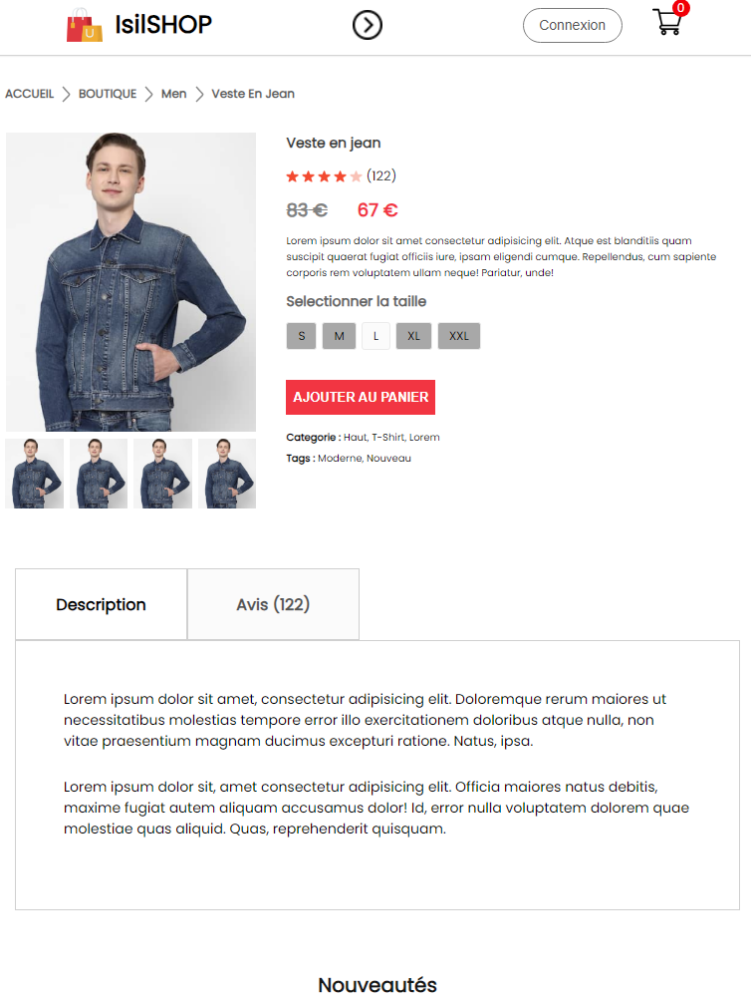
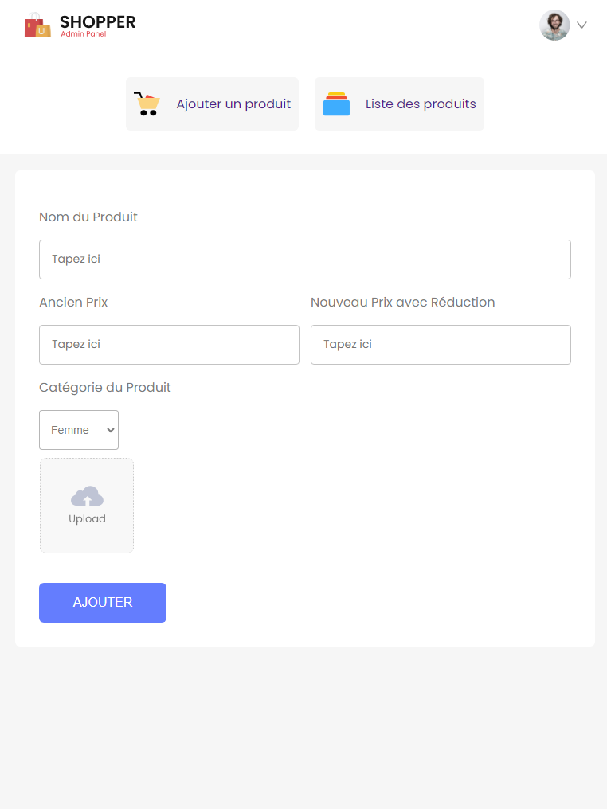

# E-commerce IsilSHOP 🛍️

## Description

Bienvenue sur IsilSHOP, une application d'e-commerce fullstack développée avec React JS et MongoDB ! Elle permet aux utilisateurs de parcourir une sélection de produits et les ajouter à leur panier. Les administrateurs ont également accès à une interface d'administration où ils peuvent gérer les produits.

## Fonctionnalités

- Connexion et déconnexion des utilisateurs
- Navigation intuitive et ergonomique
- Panier d'achat avec gestion des quantités et des commandes
- Tri des produits par prix croissant/décroissant
- Recherche de produits
- Interface administrateur pour la gestion des produits
- Base de données MongoDB pour stocker les informations des utilisateurs, des produits et des commandes
- Interface responsive pour une expérience utilisateur optimale sur tous les appareils

## Captures d'écran

 
 
*Page d'accueil* 

 
*Page catégorie "Homme"*

 
*Page produit avec détails*

 
*Interface admin pour l'ajout d'un nouveau produit dans la base de données*

## Installation et Utilisation

1. Clonez le dépôt GitHub : `git clone https://github.com/votre_utilisateur/votre_projet.git`
2. Installez les dépendances : `npm install`
3. Démarrez le serveur : `npm start`
4. Accédez à l'application dans votre navigateur à l'adresse `http://localhost:3000`

## Tester l'application

Si vous souhaitez tester l'application mais que vous avez besoin du mot de passe pour accéder à certaines fonctionnalités, n'hésitez pas à me contacter. Vous pouvez me joindre par [email](isil.isil.pro@gmail.com) ou via GitHub. Je serai ravie de vous fournir le mot de passe nécessaire pour explorer toutes les fonctionnalités de l'application ! 😊

## Stack Technique

- **Frontend :** React JS
- **Backend :** Node.js avec Express
- **Base de données :** MongoDB

 
